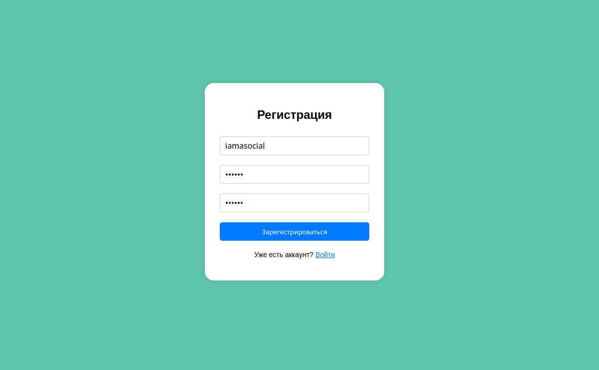
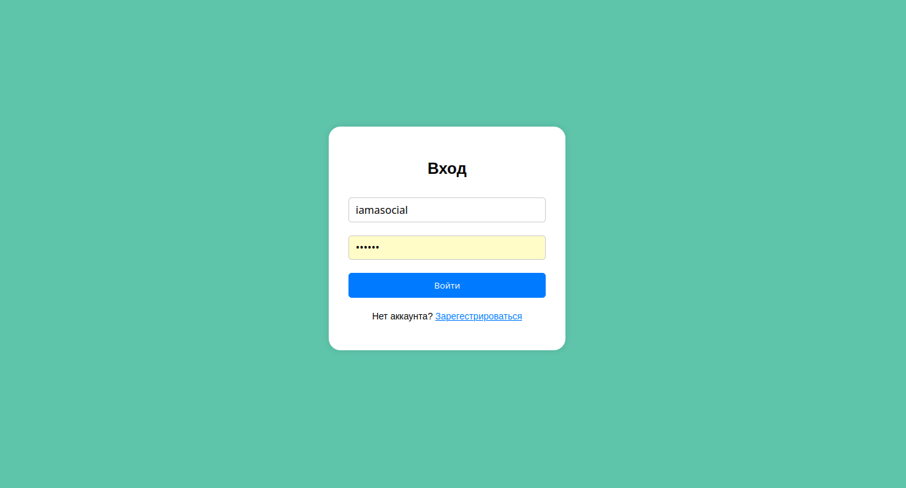
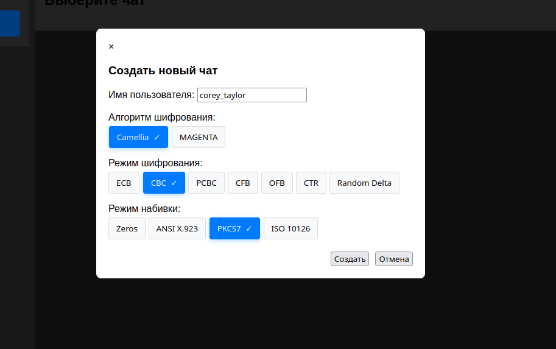
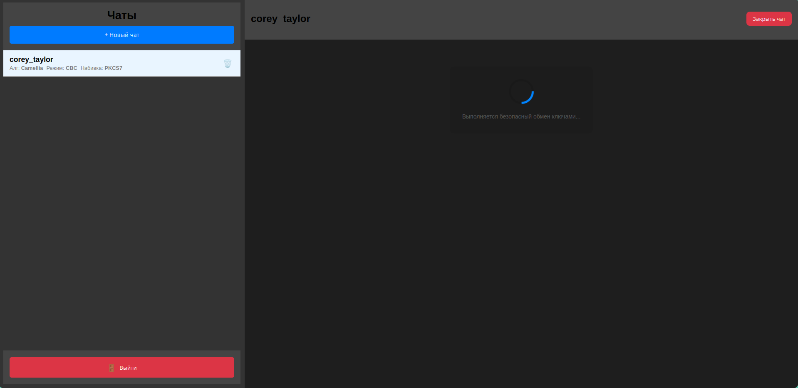
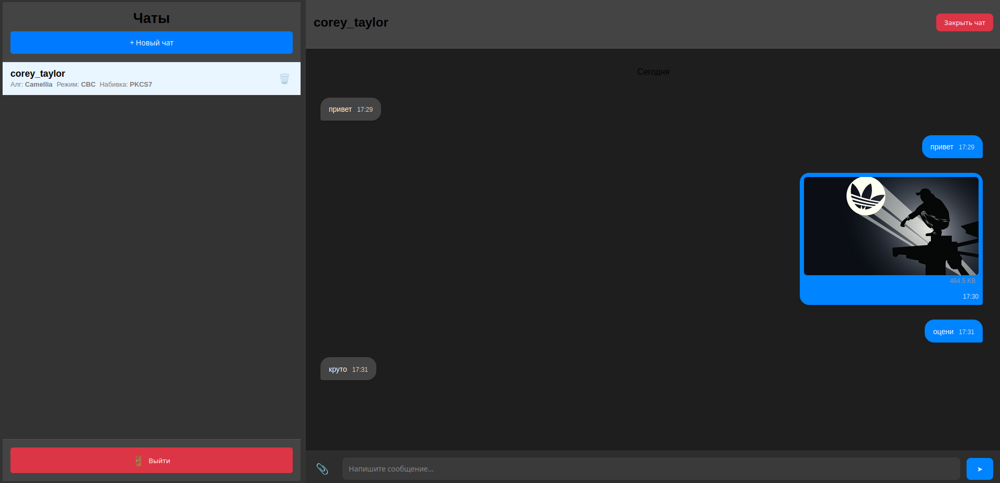

# gRPC Web Server

Защищённая платформа для обмена сообщениями и файлами, построенная на gRPC и Go.

## Описание

Это полнофункциональное приложение для обмена сообщениями, обеспечивающее безопасную связь между пользователями. Приложение построено с использованием современных технологий и реализует следующие ключевые функции:

### Основные возможности
- Защищённая аутентификация пользователей с использованием JWT токенов
- Обмен сообщениями в реальном времени через WebSocket и gRPC streams
- Сквозное шифрование сообщений с использованием протокола обмена ключами Диффи-Хеллмана
- Возможность обмена файлами с поддержкой метаданных
- Хранение сообщений и пользовательских данных в базе данных

### Технический стек
- Backend: Go с gRPC
- Frontend: Веб-интерфейс с поддержкой WebAssembly
- База данных: SQL с системой миграций
- Аутентификация: на основе JWT токенов
- Коммуникация: WebSocket и gRPC streams
- Безопасность: Обмен ключами по протоколу Диффи-Хеллмана для сквозного шифрования

## Архитектура

### Основные компоненты

#### Серверные сервисы
- **Сервис пользователей**: Управление регистрацией, аутентификацией и профилями пользователей
- **Сервис чатов**: Управление чат-комнатами и доставкой сообщений в реальном времени
- **Файловый сервис**: Управление безопасной загрузкой, скачиванием файлов и их метаданными
- **Сервис обмена ключами**: Управление безопасным обменом ключами между пользователями для сквозного шифрования

#### Функции безопасности
- Сквозное шифрование с использованием протокола обмена ключами Диффи-Хеллмана
- Безопасное хранение файлов с отдельным хранением метаданных
- Аутентификация на основе JWT токенов
- Защищённые WebSocket соединения для обновлений в реальном времени

#### Хранение данных
- SQL база данных для хранения данных пользователей, сообщений чата и метаданных файлов
- Отдельная система хранения загруженных файлов
- Система миграций для управления схемой базы данных

#### Брокер сообщений
- Обработка распределения сообщений в реальном времени
- Управление WebSocket соединениями
- Обеспечение надёжной доставки сообщений

## Скриншоты

### 1. Регистрация

### 2. Вход

### 3. Создание чата

### 4. Обмен ключами

### 5. Защищённый чат

